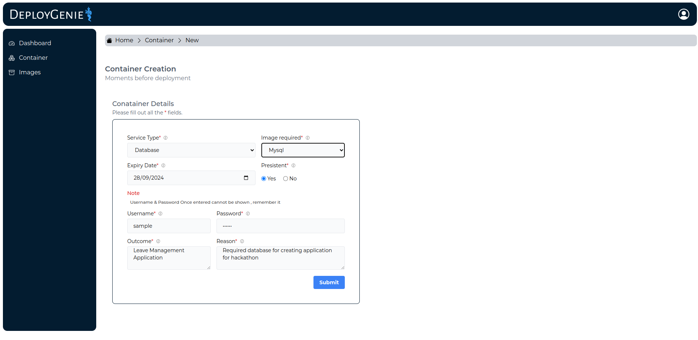
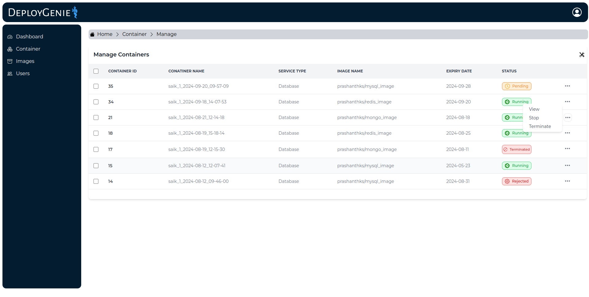
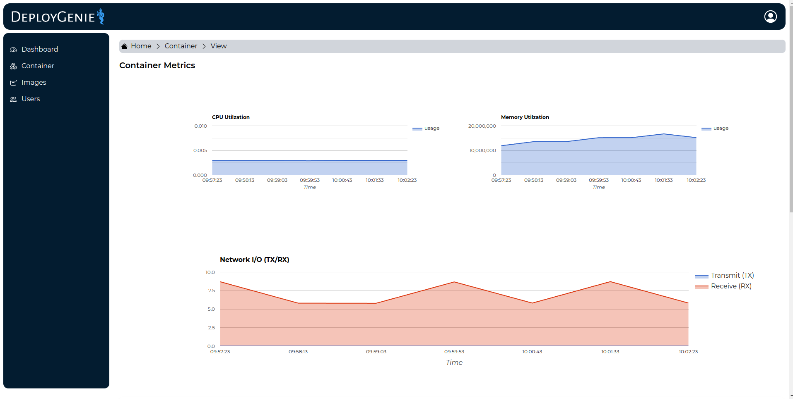
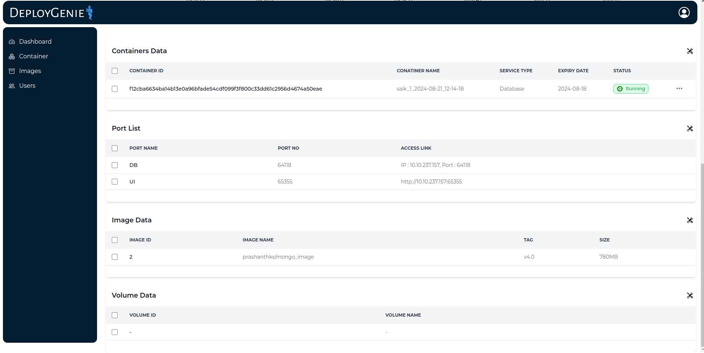
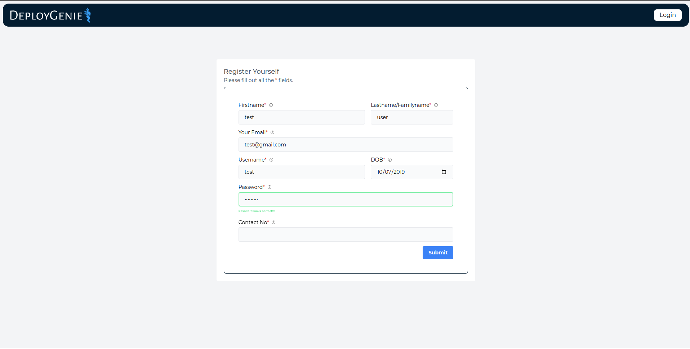
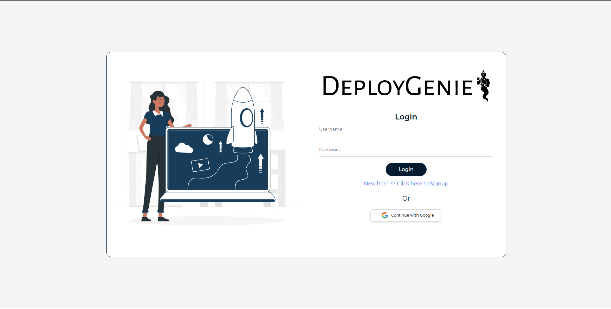
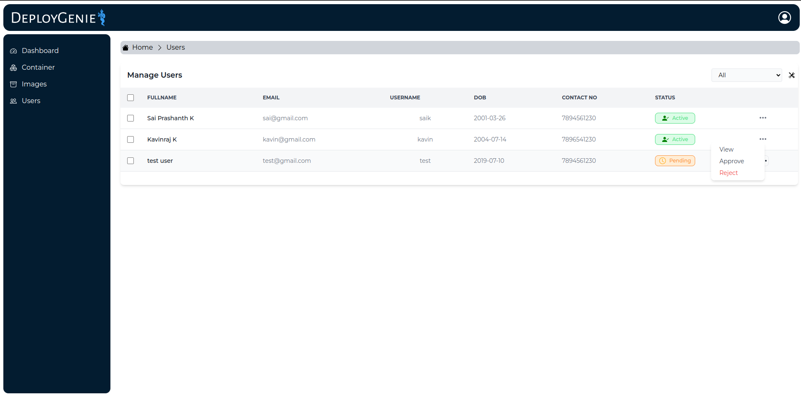

# Container Automation Project

This repository provides a container-based automation system where users can request databases, UIs, and other services. The system is powered by Docker, with a backend API built in Golang, a frontend UI built in React, and Prometheus along with cAdvisor for real-time container monitoring.

## Project Structure

- **Backend (Golang API):** Provides API endpoints to handle user requests, deployment automation, and database management.
- **Frontend (React UI):** User interface for requesting services, viewing container status, and accessing credentials.
- **Monitoring (Prometheus & cAdvisor):** Provides real-time monitoring of container metrics such as CPU, memory, and network usage.
- **Docker Compose:** Orchestrates services via Docker containers.

## Prerequisites

Before running the project, ensure that you have the following installed:

- Docker: [Get Docker](https://www.docker.com/)
- Docker Compose: [Get Docker Compose](https://docs.docker.com/compose/install/)
- Git: [Get Git](https://git-scm.com/)

## Setup Instructions

### Step 1: Clone the Repository

```
git clone https://github.com/PrashanthSai-K/DeployGenie.git
cd DeployGenie
```


### Step 2: Running the Application

```
docker-compose up -d
```

### Step 3: Accessing the Application

- **API**: Runs on port :3500.
- **UI**: Accessible via port :4000.
- **Prometheus**: Available for monitoring on port :9090.
- **cAdvisor**: Accessible on port :8085 for detailed container metrics.

### Step 4: Stopping the Application

```
docker-compose down
```

## File Structure

```
├── api/                 # Golang backend API
├── ui/                  # React frontend UI
├── prometheus/          # Prometheus monitoring configuration
├── docker-compose.yml   # Docker Compose configuration
└── README.md     
```

## Screenshots

### Container Request



### Container Management



### Container Metrics





### Registration/Login





### User Management




## License


This version includes the file structure in the given format. Let me know if you need further modifications!
